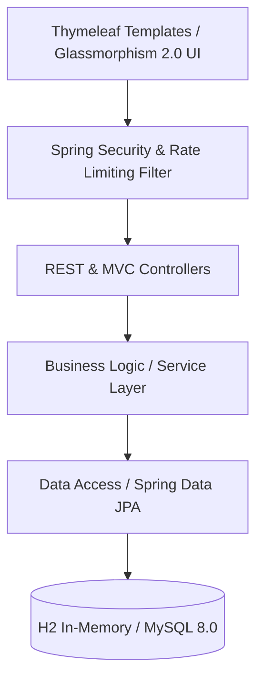

# 💳 SmartBank Enterprise Banking System

[](https://opensource.org/licenses/MIT)
[](https://spring.io/projects/spring-boot)
[](https://jdk.java.net/)
[](#)

SmartBank is a high-performance, robust, and enterprise-grade online banking application designed for modern businesses. Combining a Spring Boot 3.x backend with a premium **White Glassmorphism 2.0** frontend, the system provides separate portals for Administrators, Employees, and Customers, wrapped in a regulatory-compliant framework.

---

## 🏛️ System Architecture Overview

SmartBank follows an enterprise layered architecture ensuring high cohesion and loose coupling:



- **Presentation Layer**: Built with **Thymeleaf 3.1**, styled using highly customized CSS tokens, dynamic slide transitions, and a premium light-mode layout.
- **Security & Filter Chain**: Configured with Spring Security 6, implementing deferred CSRF session initialization (avoiding pre-commit exceptions), role-based URL authorization, and custom IP-based Rate Limiting filters.
- **Service Layer**: Fully transactional (`@Transactional`) operations for transfers, account lifecycle changes, loan applications, and audit trails.
- **Data Layer**: Spring Data JPA abstraction with automatic schema definition, indexing, and seed data initialization on boot.

---

## ✨ Enterprise Features

### 1. Security & Traffic Control
* **Deferred CSRF Protection**: Special resolution divs prevent Thymeleaf session exceptions by forcing CSRF initialization before the response stream commits.
* **IP Rate Limiter**: Middleware intercepts incoming requests, bucket-limiting active threads per client identifier to prevent Denial-of-Service attacks.
* **Role-Based Access Control (RBAC)**: Fine-grained path security dividing routes strictly into `/admin/**`, `/employee/**`, and `/customer/**`.

### 2. Banking Core Operations
* **Double-Entry Bookkeeping Simulation**: Real-time transfers supporting NEFT, RTGS, IMPS, UPI, and local transfer routes with atomic status tracking.
* **Auditing engine**: Automated logging of security events and significant transactions.
* **Dynamic Monthly Settlements**: Simulated interest engines and payment runs that execute dynamically to update dashboard statistics.

### 3. Modern Design System (Glassmorphism 2.0)
* Pure, clean white glass cards with soft drop shadows and backdrop filters (`blur(20px)`).
* Elegant transitions, custom hover animations, and font pairings (Plus Jakarta Sans, Satisfy, and Dancing Script).
* Full responsiveness scaling across mobile, tablet, and ultra-wide screens.

---

## 🛠️ Technology Stack

| Component | Technology | Description |
|-----------|------------|-------------|
| **Core Framework** | Spring Boot 3.2.0 | High-performance application bootstrapping and configuration |
| **Security** | Spring Security 6 | Authentication, authorization, CSRF control, and secure headers |
| **Template Engine** | Thymeleaf 3.1.2 | Server-side HTML rendering with strict security contexts |
| **Database** | H2 Database / MySQL 8.0 | Dual profile support for instant local runs and persistent production environments |
| **Build Automation** | Maven 3.9.x | Dependency management and build packaging |
| **Styling** | Vanilla CSS3 & Bootstrap 5 | Glassmorphism 2.0 design system, variables, custom transitions |
| **Icons & Fonts** | FontAwesome 6.4 & Google Fonts | Custom iconography and branding typography |

---

## 📂 Project Directory Structure

```text
SmartBank-Fixed/
├── src/
│   ├── main/
│   │   ├── java/com/onlinebanking/
│   │   │   ├── config/          # Application Security, Exception & Initializer Configs
│   │   │   ├── controller/      # Portal controllers (Admin, Employee, Customer, Auth)
│   │   │   ├── dto/             # Data Transfer Objects for inputs validation
│   │   │   ├── entity/          # JPA Entities (User, Account, Transaction, Card, etc.)
│   │   │   ├── repository/      # Spring Data JPA repositories
│   │   │   ├── security/        # Custom filters, event listeners & rate limiting
│   │   │   └── service/         # Transactional business logic implementation
│   │   └── resources/
│   │       ├── static/          # CSS, JS, and custom brand graphics/logos
│   │       ├── templates/       # Thymeleaf template directories organized by role
│   │       ├── application.properties
│   │       └── application-h2.properties
│   └── test/                    # Unit & Integration tests
├── pom.xml                      # Maven project configuration
├── Dockerfile                   # Single stage build container definition
└── docker-compose.yml           # Multi-container orchestration definition
```

---

## 🔐 Default Access Credentials

SmartBank seeds initial data automatically upon first startup. Use the following credentials to access the portal dashboards:

| Role | Username | Password | Access Path | Description |
|------|----------|----------|-------------|-------------|
| **Administrator** | `admin` | `Admin@123` | `/admin/dashboard` | Organization control, branch setup, staff management |
| **Customer** | `customer1` | `Customer@123` | `/customer/dashboard` | Personal balances, transfers, loan applications, cards |
| **Employee** | `employee1` | `Employee@123` | `/employee/dashboard` | KYC validations, credit and loan approvals |

---

## 🚀 Quickstart & Setup Guide

### Prerequisites
* Java Development Kit (JDK) 17 or higher
* Apache Maven 3.8+
* Docker & Docker Compose (Optional)

### Option A: Local Run with In-Memory H2 (Recommended for Testing)
Run with the preconfigured H2 Database profile to instantly boot the server without configuring a database.

1. Clone the repository and navigate to the project directory:
   ```bash
   cd SmartBank-Fixed
   ```
2. Build the project:
   ```bash
   mvn clean compile
   ```
3. Run the Spring Boot application using the `h2` profile:
   ```bash
   mvn spring-boot:run "-Dspring-boot.run.profiles=h2"
   ```
4. Access the portal at **[http://localhost:8085](http://localhost:8085)**.

---

### Option B: Local Run with MySQL 8.0
1. Create a MySQL database named `smartbank_db`:
   ```sql
   CREATE DATABASE smartbank_db CHARACTER SET utf8mb4 COLLATE utf8mb4_unicode_ci;
   ```
2. Update your credentials in `src/main/resources/application.properties`:
   ```properties
   spring.datasource.url=jdbc:mysql://localhost:3306/smartbank_db?useSSL=false&serverTimezone=UTC
   spring.datasource.username=YOUR_MYSQL_USERNAME
   spring.datasource.password=YOUR_MYSQL_PASSWORD
   ```
3. Compile and launch:
   ```bash
   mvn clean spring-boot:run
   ```

---

### Option C: Containerized Deployment via Docker Compose
1. Ensure Docker is running.
2. Build and start the containerized service stack:
   ```bash
   docker-compose up --build -d
   ```
3. The server will be accessible at **http://localhost:8085**.

---

## 📈 Quality Assurance & Bug Fix Log

* **Thymeleaf 3.1 Expression Upgrade**: Fixed rendering crashes by replacing deprecated `#request.requestURI` calls with clean contextual check expressions.
* **Deferred CSRF Fix**: Resolved `IllegalStateException` on login forms by forcing early session establishment during the initial templating pass.
* **Auto-refresh simulator**: Real-time simulated ledger updates that push instant changes directly onto dynamic views.

---

## 📄 License
This project is licensed under the MIT License - see the LICENSE file for details.
